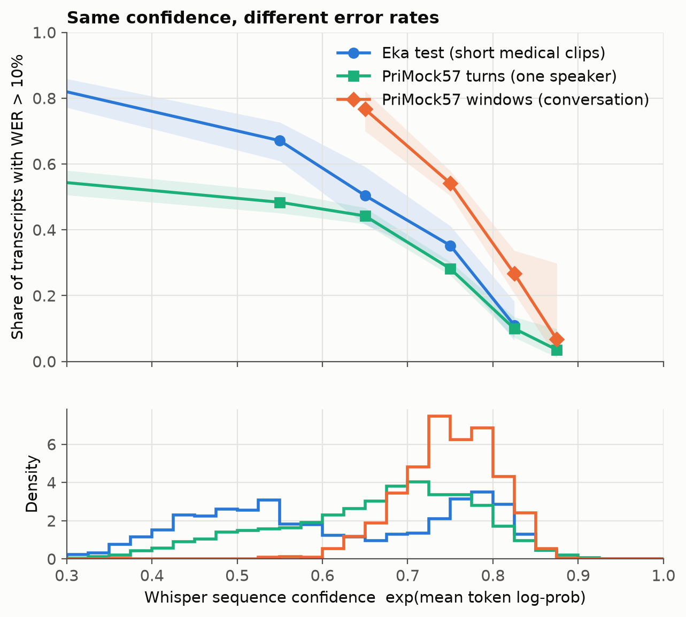
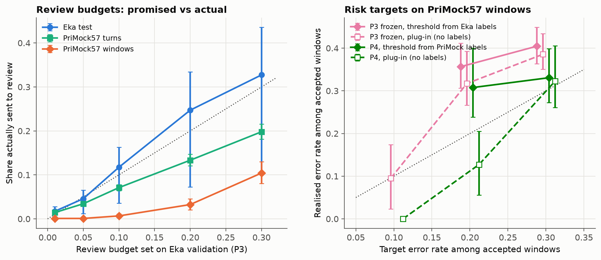
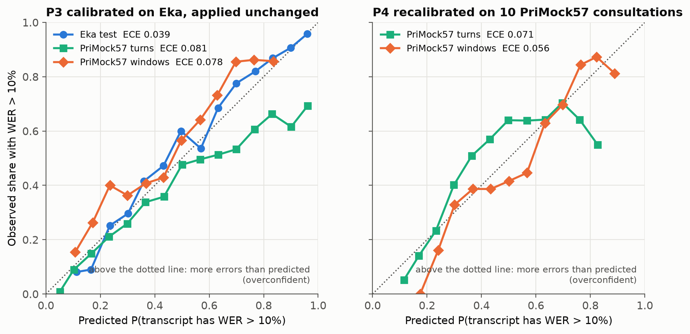
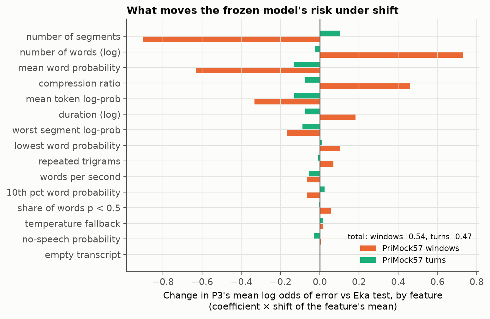

# When ASR Confidence Does Not Travel

**Selective review of Whisper transcripts under clinical speech domain shift.**
Course project for CSE 598 *Operationalizing Deep Learning: A Sociotechnical Perspective*,
Arizona State University, Fall 2026.

[](https://colab.research.google.com/github/neric-joel/DL-Project-/blob/main/notebooks/reproduce_colab.ipynb)

## Findings in brief

Whisper-small, 11,213 transcripts. The review policy was calibrated on Eka (Indian-English medical
clips, median 5 words) and applied unchanged to PriMock57 consultations cut into 30-second windows
(median 67 words, 4.8 speaker turns). Every number below comes from [results/SUMMARY.md](results/SUMMARY.md).
Intervals are 95% cluster-bootstrap intervals, and hypothesis tests are one-sided and Holm-adjusted.

1. **Whisper sounds more sure on conversations, but it is not more right.** Mean sequence confidence is
   0.75 on PriMock57 windows against 0.61 on Eka clips, yet about half of the transcripts need correcting
   in both (WER above 10%: 52% vs 55%). At any given confidence, a conversation window is more often
   wrong (figure 1).
2. **Frozen thresholds stop working.** A threshold that sends 10% of Eka validation clips to review sends
   11.8% of held-out Eka clips, but only **0.3%** of conversation windows (0.1% for raw confidence).
   52% of the windows it accepts automatically have WER above 10%. The share of erroneous transcripts that
   slip through rises by 20 points (**H2 supported**, p = 0.004).
3. **The calibrated model is overconfident on conversations.** It predicts that 44% of windows are
   erroneous, but 52% are: calibration-in-the-large −0.074 [−0.111, −0.038] (**H1 supported**, p = 0.003).
   Calibration error doubles (ECE 0.039 → 0.078) and ranking gets worse (AUROC 0.84 → 0.72). On short
   single-speaker turns it errs the other way (underconfident, +0.081).
4. **Why: length and speaker overlap, not word confidence.** At word level Whisper is *under*confident on
   PriMock57: 94.5% of words are right against a mean word probability of 0.886 (**H4 supported** for
   word-level ECE, 0.060 vs 0.026, but not in the direction the proposal expected). The transcript-level
   failure follows from longer, multi-speaker units:
   * the frozen model's length and segment-count features extrapolate (figure 7), and the same model
     without them is not overconfident;
   * a simulation in which Whisper's word probabilities are perfectly calibrated produces a gap of the
     same size (null median −0.105 [−0.192, −0.016]);
   * 88% of windows contain overlapping speech, and those windows carry the errors (55% erroneous against
     28% without overlap);
   * at matched length (25–41 words), single-speaker turns are calibrated (−0.001) while windows are still
     overconfident (−0.141 [−0.224, −0.044]). Multi-speaker audio therefore adds something beyond length,
     although this rests on 88 windows.
5. **Recalibration fixes the probabilities, at a price.** Refitting two parameters on 10 PriMock57
   consultations moves calibration-in-the-large from −0.074 to +0.029. The label-free plug-in rule then
   keeps a 20% error promise (11.6% realised, against 31.2% for the frozen model), but only by sending
   **96% of windows** to a human. None of the recalibration contrasts survives Holm correction (H3a and
   H3c not supported). H3b's verdict changed with a post-hoc scoring fix, so it is reported as unstable
   ([protocol, amendment 6](docs/PROTOCOL.md)).
6. **Clinically critical words.** Negations are recognised 95.5% of the time on Eka but 87.8% on windows
   (86.1% on turns), and 24% of windows contain a missed or wrong number or negation. Under the frozen
   10% budget, an average test consultation has 8 auto-accepted dose or negation errors. A policy trained
   on WER does not target these errors.
7. **A label-free alarm would have caught the shift.** At the frozen threshold, the share of windows sent to
   review falls outside its Eka interval, and mean confidence moves by 0.8 Eka standard deviations. Neither
   needs a single target label.

**For a team deploying a clinical scribe:** do not carry a review threshold from dictation-style audio to
conversations. Monitor the review share and the confidence distribution for drift. Recalibrate on a few
labelled consultations from the target setting before trusting auto-accept, and with a model of this
size expect most conversation windows to need a human. Add a separate check for doses and negations,
because a WER-based policy does not look for them.

| | |
|:---:|:---:|
|  |  |
| **Figure 1.** Error rate by Whisper confidence, and the confidence distributions. | **Figure 4.** Review share and accepted-error rate: promised vs realised. |
|  |  |
| **Figure 2.** Reliability of the frozen (left) and recalibrated (right) model. | **Figure 7.** Which features move the frozen model's risk on PriMock57. |

All ten figures are in [results/figures/](results/figures/).

## The question

Speech recognition is now used to draft clinical notes. The dangerous errors are the confident ones
(a dose, a drug name, a missed "not"), because nobody checks a transcript the system is sure about.
A **review policy** turns confidence signals that Whisper produces anyway into a risk score for each
transcript, sends the riskiest ones to a human, and accepts the rest automatically.

> Does a review policy calibrated on short medical speech stay reliable when it is applied, unchanged,
> to longer conversations between doctors and patients?

We calibrate on the **Eka Medical ASR Evaluation Dataset** (short English medical clips, many Indian
drug brand names) and deploy on **PriMock57** (57 simulated primary-care consultations, doctor and
patient). Whisper's weights are never changed.

## How it works

```
 audio ──► faster-whisper (small) ──► transcript + decoder statistics
                                           │
                     ┌─────────────────────┴──────────────────────┐
                     ▼                                             ▼
        confidence features (15)                     scoring against the human transcript
        log-prob, word probabilities,                WER, S/D/I, dose & negation tokens,
        no-speech, repetition, length ...            Eka entities  ──► label: WER > 10%
                     │                                             │
                     ▼                                             │
        review policy ──► risk ──► accept / send to human ◄────────┘  (evaluation only)
```

| Policy | Risk score | Fitted on | Thresholds tuned on |
|---|---|---|---|
| **P1** raw confidence | 1 − exp(mean token log-probability) | – | Eka validation |
| **P2** Whisper's rules | no-speech probability, compression ratio, repeated trigrams | – | Eka validation |
| **P3** Eka-calibrated, frozen | logistic regression on 15 decoder features | Eka calibration | Eka validation |
| **P4** recalibrated | P3 with a two-parameter (Platt) refit | 10 PriMock57 consultations | same 10 consultations |

Each policy is run at three kinds of operating point: a **review budget** (send the top 10% to a human),
an **empirical risk target** (keep the error rate among accepted transcripts at or below 20%, tuned on
labelled data), and a **plug-in rule** (the same target, computed from the model's own probabilities on
unlabelled incoming transcripts). The last one works only if the probabilities are calibrated, which is
exactly what domain shift breaks.

**Target units.** PriMock57 is cut two ways. *Windows* mix both channels into stretches of up to 30 s
cut only between utterances (4.8 speaker turns on average): the unit a chunked clinical scribe would
transcribe. *Turns* are single utterances from one speaker's channel, a control that is conversational
but short and single-speaker, like the Eka clips.

The full design, every definition, and the two amendments recorded before any PriMock57 transcript
was scored are in **[docs/PROTOCOL.md](docs/PROTOCOL.md)**. Data handling is in
[docs/DATA.md](docs/DATA.md).

## Reproducing the results

Tested on Windows 11 (RTX 3050 Laptop 4 GB) and Linux (Colab T4) with Python 3.12.

**1. From the committed per-unit results (minutes, no GPU, no downloads).**
Every table, figure and `results/SUMMARY.md` is rebuilt from `results/units/`.

```bash
python -m venv .venv
source .venv/bin/activate            # Windows: .venv\Scripts\activate
pip install -r requirements.txt
pip install --no-deps -e .
asrshift evaluate && asrshift figures && asrshift report
```

**2. The whole pipeline from raw audio (about 1 hour on a 4 GB GPU).**

```bash
pip install -r requirements-gpu.txt   # CUDA 12 cuBLAS for ctranslate2 (not needed on Colab)
asrshift download     # Eka parquet shards (HF Hub) + PriMock57 audio (GitHub LFS), ~2.1 GB, pinned revisions
asrshift prepare      # units, speaker-disjoint Eka split, consultation split
asrshift infer        # whisper-small on 11,213 units; resumable
asrshift score        # WER, critical tokens, entities, labels, features
asrshift evaluate     # policies, operating points, bootstrap, hypothesis tests (~15 min on CPU)
asrshift figures
asrshift report
```

`asrshift all` runs the same sequence. On a machine without a GPU, `asrshift infer --device cpu
--compute-type int8` works but takes several hours.

**3. Google Colab.** [notebooks/reproduce_colab.ipynb](notebooks/reproduce_colab.ipynb) runs route 1 in
a couple of minutes, and route 2 on a free T4.

**4. Docker (CPU).**

```bash
docker compose run --rm reproduce     # tests + tables + figures + summary from committed results
docker compose run --rm pipeline      # full pipeline on CPU (slow)
```

**Tests:** `pytest` (unit tests plus a synthetic end-to-end run of the evaluation; tests marked `data`
also check the real splits for leakage when the data is present).

## Demo: Transcript Review Console

A local web app over the results: pick the audio the system sees (Eka clips, PriMock57 turns or
windows), a policy and an operating point, and see how many transcripts it sends to review, how many
wrong ones it lets through, and why. Each transcript shows the audio, what Whisper wrote (shaded by word
confidence), a colour-coded diff against the human transcript, and the risk under every policy.
*Run Whisper on this audio now* re-decodes the clip live and scores it with the exported policies.

```bash
pip install -r requirements-app.txt
uvicorn app.server:app --port 8765     # then open http://127.0.0.1:8765
```

Playback and live decoding need the downloaded data; everything else works from `results/` alone.

## Repository layout

```
configs/default.yaml     every setting that shapes a reported number
src/asrshift/            download, prepare, infer, score, features, policies, metrics, evaluate, plots, report
app/                     Transcript Review Console (FastAPI + static page)
notebooks/               Colab notebook (generated by scripts/make_colab_notebook.py)
results/units/           per-unit and per-word scores (inputs to every table)
results/tables/small/    all result tables (CSV)
results/figures/         all figures
results/SUMMARY.md       key numbers, generated from the tables
results/splits/          unit-to-split assignments
docs/PROTOCOL.md         study protocol, deviations from the proposal, amendments
docs/DATA.md             datasets, units, splits, transcriber tags
tests/                   pytest suite
```

## Limitations

* **One model (so far).** The confirmatory results are for whisper-small. A whisper-large-v3-turbo run is
  declared as exploratory ([configs/large-v3-turbo.yaml](configs/large-v3-turbo.yaml)).
* **Post-hoc scoring fix.** A normalisation defect ("Oh" read as the digit 0, plus unit spellings) was
  found after the first results. It was fixed symmetrically and everything was rerun, and the protocol reports
  every key number before and after (amendment 6).
* **Simulated consultations.** PriMock57 is role-played by clinicians and staff, recorded over video
  calls, and transcribed verbatim. It is not real clinical data, and its speakers, accents and recording
  channel differ from Eka's in several ways at once. The shift we measure is a realistic *bundle*, not one
  isolated factor. The turn-level control separates length and multi-speaker audio from the rest.
* **Oracle segmentation.** Windows are cut at the human-annotated utterance boundaries, which acts as a
  perfect voice-activity detector. A deployed system would cut less cleanly, so the target-domain error
  is probably understated.
* **Shared clinicians.** The 57 consultations were run by 7 clinicians, so the recalibration and test
  consultations share clinicians. Recalibration here means *same clinic*, not *new clinicians*.
* **Label depends on length.** "WER above 10%" means *any error* for a 3-word clip and *7 or more errors*
  for a 66-word window. The length-stratified analysis, the length-matched contrast and the null
  baseline in the protocol check how much of the effect this explains.
* **Medical terms on PriMock57** are matched with a lexicon built from Eka's human entity annotations
  (270 shared terms). The comparison is exploratory, and a manual precision check of 100 matches
  (`results/terms/audit_sample.csv`) is still to be filled in by the team.

## Team

| Member | Responsibilities (from the proposal) |
|---|---|
| Neric Joel A | Project coordination; Eka preparation, session split and entity scoring |
| Amrish Sasikumar | Whisper inference with faster-whisper; confidence signals per segment |
| Nirmalraju Kangeyan | PriMock57 preparation and consultation split; WER, insertion and deletion scoring; lexicon matching and audit |
| Harshini Balamurugan Vadivazhagi | Calibration models and the four review policies, including PriMock57 recalibration |
| Ulagarchana Ulaga Narasimhan | Evaluation metrics, reliability diagrams, review budgets and risk–coverage results; figures and repository |

## Data and licences

Code: MIT (see [LICENSE](LICENSE)). The datasets are not included and keep their own licences:
Eka Medical ASR Evaluation Dataset (MIT, © Eka Care) and PriMock57 (CC BY 4.0, Papadopoulos Korfiatis
et al., 2022, *PriMock57: A Dataset of Primary Care Mock Consultations*, ACL). Whisper (Radford et al.,
2023) is run through [faster-whisper](https://github.com/SYSTRAN/faster-whisper).
